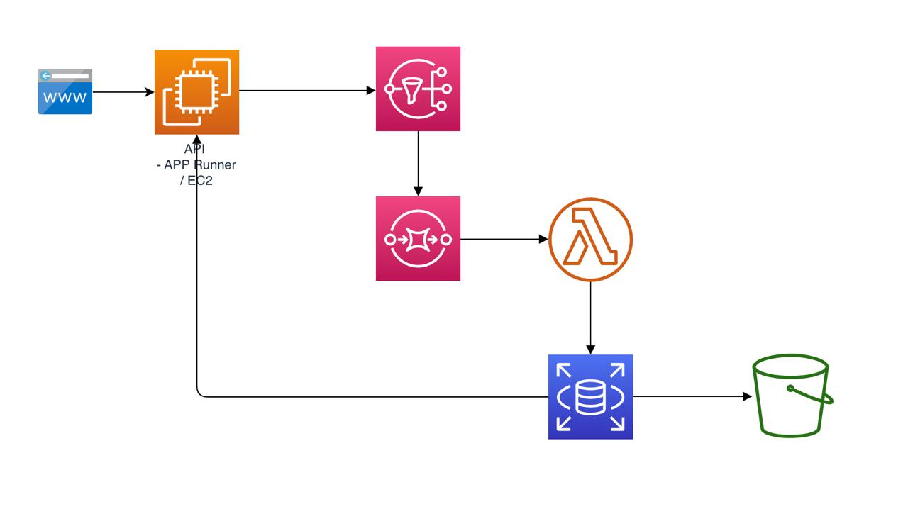

# AWS_Streaming
Ejercicio completo de AWS Streaming con la siguiente arquitectura:



Para conseguir el objetivo de este ejercicio, se deben seguir los siguientes pasos:

# 0. Configurar Terraform

Para poder desplegar la infraestructura necesaria, se debe configurar Terraform con las credenciales de AWS y el Bucket necesario para el estado de Terraform.

```bash
aws s3api create-bucket --bucket pnieto-terraform-state --region eu-west-1 --create-bucket-configuration LocationConstraint=eu-west-1
```

output:

```bash
{
    "Location": "http://pnieto-terraform-state.s3.amazonaws.com/"
}
```

Una vez creado el bucket, se debe configurar Terraform con la siguiente configuración:

```yaml
terraform {
  backend "s3" {
    bucket = "pnieto-terraform-state"
    key    = "terraform/state"
    region = "eu-central-1"  # Change to your desired AWS region
  }
}
```

Ahora proceded a inicializar Terraform:

```bash
terraform init 
```

Fijaros en el siguiente output:

```bash
Initializing provider plugins...
- Finding latest version of hashicorp/aws...
- Installing hashicorp/aws v5.89.0...
- Installed hashicorp/aws v5.89.0 (signed by HashiCorp)
```

Apliquemos el siguiente comando para aplicar nuestra configuración:

```bash
terraform plan 
```

Fijaros en el siguiente output:

```bash
No changes. Your infrastructure matches the configuration.
```


# AWS_Streaming
Ejercicio completo de AWS Streaming con la siguiente arquitectura:


Para conseguir el objetivo de este ejercicio, se deben seguir los siguientes pasos:

## 0. Configurar Terraform

Para poder desplegar la infraestructura necesaria, se debe configurar Terraform con las credenciales de AWS y el Bucket necesario para el estado de Terraform.

1. Crear un bucket S3 para almacenar el estado de Terraform.
2. Configurar Terraform para usar el bucket S3 como backend.
3. Inicializar Terraform.
4. Aplicar la configuración de Terraform.

### Completado:
El alumno debe ser capaz de inicializar y aplicar la configuración de Terraform sin errores.

## 1. Crear API Local

### Objetivo:
Crear una API local utilizando Flask que permita conectar con los mensajes enviados desde el generador.

### Pasos:
1. Instalar Flask.
2. Crear un archivo `app.py` con la configuración básica de Flask.
3. Definir los endpoints necesarios para la API.

### Completado:
El alumno debe ser capaz de ejecutar la API localmente y acceder a los endpoints definidos.

## 2. Mostrar HTML con la API en Local

### Objetivo:
Mostrar un HTML que consuma la API localmente.

### Pasos:
1. Crear un archivo `index.html` en la carpeta `templates`.
2. Modificar `app.py` para renderizar el HTML.
3. Asegurarse de que el HTML consuma la API correctamente.

### Completado:
El alumno debe ser capaz de acceder a la página HTML y ver los datos obtenidos de la API.

## 3. Desplegar App Runner en AWS

### Objetivo:
Desplegar la API en AWS utilizando AWS App Runner y acceder a ella a través de la URL proporcionada por AWS.

### Pasos:
1. Crear un repositorio ECR para la imagen Docker.
2. Crear un archivo `Dockerfile` para la API.
3. Construir y subir la imagen Docker al repositorio ECR.
4. Crear un servicio App Runner utilizando la imagen Docker.

### Completado:
El alumno debe ser capaz de acceder a la URL proporcionada por AWS App Runner y ver la API funcionando.

## 4. Crear una VPC con 1 Subnet Pública y Privada

### Objetivo:
Crear una VPC en AWS con una subnet pública y una subnet privada.

### Pasos:
1. Crear una VPC.
2. Crear una subnet pública.
3. Crear una subnet privada.
4. Crear una gateway de internet y asociarla a la VPC.
5. Crear una tabla de rutas y asociarla a la subnet pública.

### Completado:
El alumno debe ser capaz de crear una VPC con una subnet pública y una subnet privada.

## 5. Crear una RDS dentro de la Subnet Privada

### Objetivo:
Crear una instancia de RDS dentro de la subnet privada de la VPC.

### Pasos:
1. Crear un grupo de seguridad para la RDS.
2. Crear una instancia de RDS en la subnet privada.

### Completado:
El alumno debe ser capaz de crear una instancia de RDS dentro de la subnet privada de la VPC.

## 6. Modificar el Código de la API para que Lea Datos de la Base de Datos

### Objetivo:
Modificar el código de la API para que lea datos de la base de datos RDS.

### Pasos:
1. Instalar el cliente de base de datos necesario.
2. Modificar `app.py` para conectarse a la base de datos RDS.
3. Asegurarse de que los endpoints de la API lean datos de la base de datos.

### Completado:
El alumno debe ser capaz de acceder a la API y ver los datos de la base de datos RDS.

## BONUS

### 1. Crear un SNS / SQS

### Objetivo:
Crear un SNS (Simple Notification Service) y un SQS (Simple Queue Service) en AWS.

### Pasos:
1. Crear un tema SNS.
2. Crear una cola SQS.
3. Suscribir la cola SQS al tema SNS.

### Completado:
El alumno debe ser capaz de crear un SNS y un SQS en AWS y suscribir la cola SQS al tema SNS.

### 2. Crear un Formulario de Creación que Envíe un Mensaje a SNS

### Objetivo:
Crear un formulario de creación en la API que envíe un mensaje a SNS.

### Pasos:
1. Modificar `app.py` para enviar un mensaje a SNS.
2. Crear un archivo `new.html` con el formulario de creación.

### Completado:
El alumno debe ser capaz de acceder al formulario de creación y enviar un mensaje a SNS.

### 3. Crear una SQS que Lea de la SNS

### Objetivo:
Crear una SQS que lea mensajes de la SNS.

### Pasos:
1. Crear una cola SQS.
2. Suscribir la cola SQS al tema SNS.

### Completado:
El alumno debe ser capaz de crear una SQS que lea mensajes de la SNS.

### 4. Crear una Lambda que Inserte en la Base de Datos

### Objetivo:
Crear una función Lambda que lea mensajes de la SQS y los inserte en la base de datos RDS.

### Pasos:
1. Crear un archivo `lambda_function.py` con la lógica de inserción en la base de datos.
2. Crear un archivo `requirements.txt` con las dependencias necesarias.
3. Crear un archivo `Dockerfile` para la función Lambda.
4. Construir y subir la imagen Docker al repositorio ECR.
5. Crear una función Lambda utilizando la imagen Docker.
6. Crear un evento de origen para la función Lambda.

### Completado:
El alumno debe ser capaz de crear una función Lambda que lea mensajes de la SQS y los inserte en la base de datos RDS.